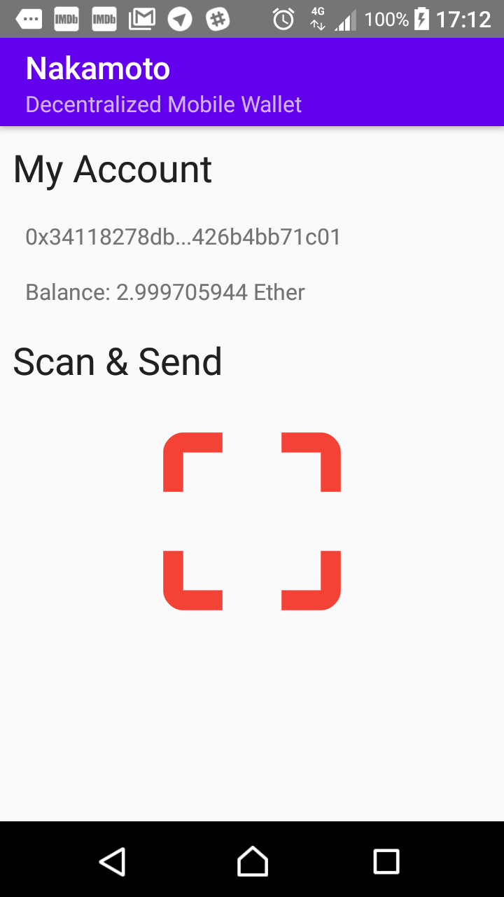

# Nakamoto Mobile Wallet

This mobile wallet creates Ethereum HD wallet, allows easy Ether transfers between same wallet owners.



## Technology

* [React Native](https://github.com/facebook/react-native)
* [React Navigation](https://github.com/react-navigation/react-navigation)
* [Redux](https://github.com/reduxjs/redux)
* [Paper UI](https://github.com/callstack/react-native-paper)
* [i18n](https://github.com/AlexanderZaytsev/react-native-i18n)
* [Web3](https://github.com/ethereum/web3.js/)
* [Truffle](https://github.com/trufflesuite/truffle)
* Etc.

## Note

1. Not done or tested on iOS.
2. This version is configured for Rinkeby TestNet.
3. This version uses 24 seed words, instead of 12.

## Todo

* Contracts (for fully featured mdApp)
* Tokens wallet
* Private keys/ seeds import/ export
* One account for one transaction (through HD wallet).
* Tooltip when copying address
* RN NetInfo.isConnected bug and reduxify network availability.
* Encrypt storage data with user password
* Nonce too low workaround.
* Faster data (like last balance) loads with persisted state.

## Start

```bash
npm i -g cross-env react-native-cli rn-nodeify @babel/core @babel/cli

# Additional 2 steps for Windows:
npm i -g --production windows-build-tools
npm config set msvs_version 2015 -g

# Then:
npm i
rn-nodeify --hack --install
npm run bundle
npm run android
```

## Send & Receive


To test the app:

1. Request your own Infura API key and add to .env(s)
2. Request Rinkeby Ether to the mdApp address.
3. Open another mdApp instance (phone or emulator).
4. Go to Receive screen on second instance and Send on first instance.
5. Scan the code, make a transaction.

Or use this example QR code:


Also consult with mdApp Help page.

## Test

Current version has problems: https://github.com/wix/detox/issues/821

```bash
npm i -g jest
react-native start
detox build --configuration android.emu.debug
detox test --configuration android.emu.debug
```

## Release

### Android

Mostly automatic build, sign and zipalign:

```bash
pip install -r requirements.txt
python build_apk.py # Note, this file is hardcoded for Windows paths!!
```

Fast test:

```bash
npm run android:release
```

## Licence

MIT
